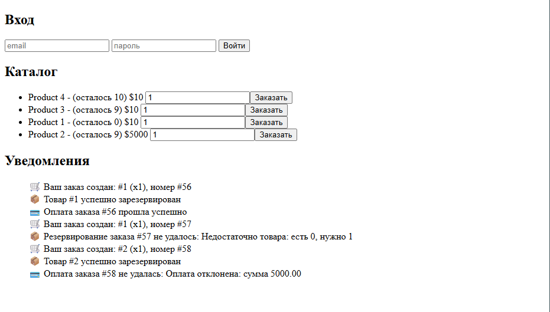

# E-commerce Microservices

Учебный проект: auth, order, notification сервисы на Spring Boot + Kafka + Redis + Postgres.
- auth-service - регистрирует и логинит пользователей. 
- order-service - создает заказы и отправляет их в очередь для обработки.
- stock-service - хранит информацию о наличии товаров.
- payment-service - обрабатывает платежи и отправляет уведомления об успешности платежа.
- notification-service - собирает сообщения из очередей и отправляет уведомления на фронт через центрифугу
- frontend - простой клиент для взаимодействия с сервисами.
- infrastructure - инфраструктура для развертывания и управления сервисами.
